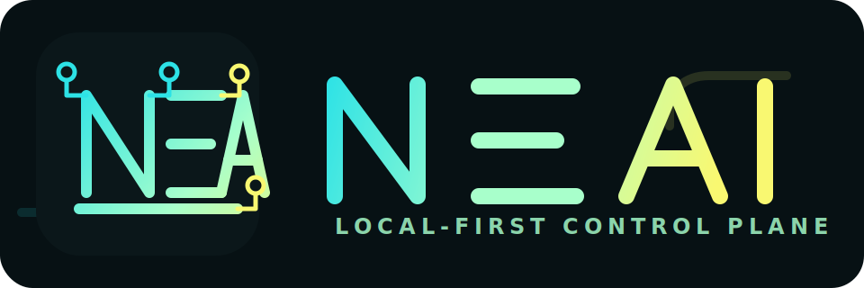

<p align="center">
  
</p>

# NEA AI

NEA AI es un control plane local-first para agentes de desarrollo con IA.

Su objetivo es preparar agentes existentes con memoria persistente, flujos de
trabajo estructurados, estado OpenSpec, configuracion MCP, verificacion y
recuperacion en un solo binario.

```text
NEA AI = installer + NeaBrain memory + Flow-NEA + OpenSpec + doctor
```

## Que Hace

- Configura NeaBrain como servidor MCP para agentes soportados.
- Instala skills, prompts y comandos de Flow-NEA.
- Inicializa estado OpenSpec en proyectos.
- Detecta agentes instalados y salud de componentes.
- Repara configuracion faltante con `doctor --fix`.
- Crea backups antes de tocar archivos de configuracion.
- Desinstala solo entradas administradas por NEA AI.

## Agentes Soportados

Soporte actual:

- Codex
- OpenCode
- Claude Code

Planeado:

- Cursor
- VS Code
- Gemini CLI

## Componentes

- `brain`: instala/configura NeaBrain como MCP server.
- `flow`: instala Flow-NEA skills, prompts y commands para el agente.

## Branding

Assets versionados:

- `assets/brand/nea-ai-logo.svg`
- `assets/brand/nea-ai-mark.svg`
- `assets/brand/nea-ai-icon.svg`

La marca combina el lenguaje visual de NEA Brain/Flow con el sentido local de
"nea" en Medellin: identidad de barrio, resiliencia, amistad y confianza urbana
aplicadas a un control plane tecnico.

Repos base:

- NeaBrain: https://github.com/RDuuke/nea-brain (`brew install RDuuke/tap/neabrain` o `scoop install neabrain`)
- Flow-NEA: https://github.com/RDuuke/sdd-nea-flow

## Instalacion

### Homebrew (macOS y Linux)

```bash
brew install RDuuke/tap/nea-ai
```

### Scoop (Windows)

```powershell
scoop bucket add rduuke https://github.com/RDuuke/scoop-bucket
scoop install nea-ai
```

### Script (Linux y macOS)

```bash
curl -fsSL https://raw.githubusercontent.com/RDuuke/nea-ai/main/scripts/install.sh | bash
```

Variables opcionales: `NEA_AI_VERSION`, `NEA_AI_BIN_DIR`.

### Script (Windows PowerShell)

```powershell
iwr https://raw.githubusercontent.com/RDuuke/nea-ai/main/scripts/install.ps1 -UseBasicParsing | iex
```

Variables opcionales: `$env:NEA_AI_VERSION`, `$env:NEA_AI_BIN_DIR`, `$env:NEA_AI_NO_PATH`.

### Paquete `.deb` / `.rpm` / `.apk`

Cada release publica paquetes nativos como assets en
<https://github.com/RDuuke/nea-ai/releases/latest>. Ejemplo Debian/Ubuntu:

```bash
curl -fsSL -O https://github.com/RDuuke/nea-ai/releases/download/v0.2.1/nea-ai_0.2.1_linux_amd64.deb
sudo dpkg -i nea-ai_0.2.1_linux_amd64.deb
```

### Descarga manual

Cada release incluye archives `tar.gz`/`zip`, paquetes `deb`/`rpm`/`apk` y
`checksums.txt` para verificar SHA256.

## Uso Rapido

```bash
nea-ai install --agent codex --components brain,flow
nea-ai install --agent opencode --components brain,flow
nea-ai install --agent claude-code --components brain,flow
```

## Inicializar Un Proyecto

```bash
nea-ai init
```

Crea:

```text
openspec/
  config.yaml
  changes/
    .status.yaml
```

## Estado

Todos los comandos emiten JSON en stdout.

```bash
nea-ai status --agent codex
nea-ai status --agent opencode
nea-ai status --agent claude-code
```

## Flow

Ver estado OpenSpec/Flow-NEA del proyecto actual:

```bash
nea-ai flow status
```

Crear un quick blueprint para un cambio chico:

```bash
nea-ai flow quick fix-readme --title "ajustar readme" --objective "Mejorar documentacion publica"
```

Crear artefactos OpenSpec para fases de Flow-NEA:

```bash
nea-ai flow explore add-feature --objective "Understand the change"
nea-ai flow propose add-feature --summary "Bounded implementation plan"
nea-ai flow continue
nea-ai flow verify add-feature --summary "CI passed" --commands "go test ./..."
```

## Doctor

Validar instalacion:

```bash
nea-ai doctor --agent opencode
```

Reparar componentes faltantes:

```bash
nea-ai doctor --fix --agent opencode
```

## Desinstalar

```bash
nea-ai uninstall --agent opencode --components brain,flow
```

`uninstall` elimina entradas y archivos conocidos administrados por NEA AI. No
borra configuracion ajena del usuario.

## Desarrollo

Correr el CLI desde el repo sin instalar:

```bash
go run ./cmd/nea-ai status --agent codex
go run ./cmd/nea-ai flow status
go run ./cmd/nea-ai doctor --agent opencode
```

Build local con version inyectada:

```bash
go build -ldflags "-X nea-ai/internal/app.Version=v0.2.0" -o dist/nea-ai-windows-amd64.exe ./cmd/nea-ai
```

O via Makefile:

```bash
make build VERSION=v0.2.0
```

### Release Automatico

El release usa `.goreleaser.yaml`. En pull requests que tocan release, CLI o
Go module, `.github/workflows/release.yml` ejecuta `goreleaser check`. Al
empujar un tag `v*`, el mismo workflow corre GoReleaser y publica:

- archives `tar.gz`/`zip` para `linux|darwin|windows` x `amd64|arm64`
- paquetes `deb`/`rpm`/`apk`
- formula Homebrew en `RDuuke/homebrew-tap`
- manifest Scoop en `RDuuke/scoop-bucket`
- `checksums.txt` con SHA256 de todos los archives

Prerrequisito: secret `HOMEBREW_TAP_TOKEN` en el repo (PAT con scope `repo`
sobre `RDuuke/homebrew-tap` y `RDuuke/scoop-bucket`).

```bash
git tag v0.2.0
git push origin v0.2.0
```

Validar la configuracion antes de tagear:

```bash
goreleaser check
goreleaser release --snapshot --clean --skip=publish
```

## Alcance Actual

NEA AI no es otro agente de codigo. Es el runtime/control plane que prepara los
agentes existentes con memoria, flujo, verificacion y recuperacion.

El MVP actual cubre:

- instalacion multi-agente
- configuracion MCP NeaBrain
- instalacion Flow-NEA
- bootstrap OpenSpec
- `flow status`
- `flow quick`
- `flow explore`
- `flow propose`
- `flow continue`
- `flow verify`
- `status`
- `doctor`
- `doctor --fix`
- `uninstall`

## Roadmap Corto

Siguientes bloques:

- `flow` commands desde `nea-ai`
- ping real de MCP/NeaBrain
- soporte Cursor, VS Code y Gemini CLI
- releases multiplataforma
- TUI/dashboard local
